# DVLD — Driving & Vehicle License Department

A desktop management system developed with **C# and .NET 9 Windows Forms** to simulate and manage the main workflows of a Driving & Vehicle License Department (DVLD).

The system provides an integrated environment for managing people, drivers, applications, driving tests, licenses, users, authentication, and other operations related to the driving license lifecycle.

---

## 📌 Project Overview

**DVLD** is a multi-layered desktop application designed around real-world business workflows rather than simple CRUD operations.

The application manages the lifecycle of a driving license application, from creating an application and scheduling tests to passing the required tests and issuing a driving license.

It also includes authentication, password recovery, email verification, user management, license detention, international applications, and dashboard statistics.

### Main Goals

* Manage people and drivers.
* Manage driving license applications.
* Manage application types and license classes.
* Schedule and manage driving tests.
* Handle test retakes.
* Issue and manage driving licenses.
* Manage international license applications.
* Detain and release licenses.
* Manage system users.
* Provide authentication and account recovery.
* Provide dashboard statistics.
* Maintain a clear separation between UI, business logic, data access, and supporting services.

---

# ✨ Features

## 🔐 Authentication & Account Security

The project includes a complete authentication and account recovery workflow.

### Login

* User authentication.
* User validation.
* Current user management.
* Login screen with modern UI.

### Remember Me

A token-based Remember Me mechanism is implemented using:

* `TokenHelper`
* `HashHelper`
* `DPAPIHelper`
* `RememberMeManager`

The implementation includes:

* Remember token generation.
* Token hashing.
* Token expiration.
* Database storage of the token hash.
* DPAPI protection for the locally stored token.
* Stored procedures dedicated to Remember Me operations.

Relevant database procedures include:

* `SP_ClearRememberToken`
* `SP_GetUserByRememberToken`
* `SP_UpdateUserRememberToken`

> Password hashing has not yet been migrated to PBKDF2 + per-user salt. This is planned as a future security improvement.

---

## 🔑 Forgot Password

The application includes a complete password recovery workflow:

```text
Login
  │
  ▼
Forgot Password
  │
  ▼
Enter Username
  │
  ▼
Find User & Email
  │
  ▼
Generate Reset Code
  │
  ├── Hash → Database
  │
  └── Code → Email
              │
              ▼
         Verify Code
              │
              ▼
        Reset Password
              │
              ▼
            Login
```

### Password Recovery Features

* Username validation.
* User lookup.
* Email validation.
* Verification code generation.
* Hashed reset-code storage.
* Email delivery through the dedicated `DVLD_EmailService`.
* 15-minute verification-code expiration.
* Verification-code countdown timer.
* Verification-code validation.
* Password reset.
* Resend verification code.
* 60-second resend cooldown.
* Automatic reset of the 15-minute expiration when a new code is sent.

---

# 👥 People Management

The system provides functionality for managing people within the DVLD system.

Features include:

* Add people.
* Update people.
* Delete people where allowed.
* Search and filter people.
* View detailed person information.
* Manage personal information used by other DVLD modules.

---

# 🚗 Drivers Management

The Drivers module manages people who are registered as drivers.

It integrates with the license system and driving-license history.

---

# 📄 Applications Management

The Applications module manages the different types of applications handled by the DVLD.

The system supports:

* Creating applications.
* Managing application status.
* Searching applications.
* Viewing application details.
* Processing local driving license applications.
* Managing application types.
* Handling application-related business rules.

---

# 🪪 Local Driving License Workflow

The main driving license workflow is based on a sequence of required tests.

```text
Application
     │
     ▼
Vision Test
     │
     ▼
Written Test
     │
     ▼
Street Test
     │
     ▼
License Issued
```

The system determines the next required test according to the number of successfully completed tests.

### Driving Tests

The project supports three main test types:

| Test Type    | ID |
| ------------ | -: |
| Vision Test  |  1 |
| Written Test |  2 |
| Street Test  |  3 |

The business layer determines the current stage using the application's passed-test count.

---

# 📅 Test Appointments

The system provides appointment management for driving tests.

Features include:

* Schedule test appointments.
* Manage appointments.
* Prevent invalid test progression.
* Handle test retakes.
* Connect appointments to applications.
* Record test results.

The presentation layer contains dedicated modules for:

```text
TestAppointments
Tests
```

---

# 🔄 Test Retake System

When a candidate fails a test, the system supports creating a **Retake Test Application**.

The retake application is used for the administrative/financial process associated with retaking the test.

It is not treated as a new driving-license application.

The retake application is connected to the corresponding test appointment through the retake application reference.

```text
Original Application
        │
        ▼
      Test
        │
     Failed
        │
        ▼
Retake Application
        │
        ▼
New Test Appointment
        │
        ▼
     Retake
```

---

# 🪪 License Management

The Licenses module manages issued driving licenses.

The system supports license-related operations such as:

* Issuing licenses.
* Viewing license information.
* Managing license status.
* Renewing licenses.
* Handling license-related workflows.

---

# 🏷️ License Classes

The project includes a dedicated `LicenseClasses` module for managing the different driving license categories/classes used by the system.

---

# 🚫 Detain License

The `DetainLicense` module handles license detention operations.

It provides functionality related to:

* Detaining licenses.
* Managing detained-license information.
* Releasing detained licenses.
* Managing the associated business rules.

---

# 🌍 International License

The project includes an International License workflow.

The International Application module handles the creation and management of international-license-related operations.

The application also includes local country resources:

* Country names.
* Country abbreviations.
* Country flags.

Country information is also represented in the SQL Server `Countries` table.

The local flag resources and customized `csv.txt` are used as application resources and are not intended to replace the database `Countries` table.

---

# 👤 User Management

The `Users` module provides system-user management.

It integrates with the authentication system and supports managing application users and their associated information.

The project also maintains the current authenticated user through:

```text
clsCurrentUser
```

---

# 📊 Dashboard

The application includes a dedicated Dashboard module providing an overview of important system information and statistics.

The dashboard is optimized to avoid unnecessary recreation of UI components and supports event-driven refreshing when relevant application data changes.

---

# 🏗️ Architecture

The project follows a layered architecture with dedicated supporting modules.

```text
                    ┌──────────────────────────┐
                    │   Presentation Layer     │
                    │                          │
                    │ WinForms / Guna UI2      │
                    └────────────┬─────────────┘
                                 │
                                 ▼
                    ┌──────────────────────────┐
                    │     Business Layer        │
                    │                          │
                    │ Business Rules / Logic   │
                    └────────────┬─────────────┘
                                 │
                                 ▼
                    ┌──────────────────────────┐
                    │   Data Access Layer       │
                    │                          │
                    │ ADO.NET / Stored Procs   │
                    └────────────┬─────────────┘
                                 │
                                 ▼
                    ┌──────────────────────────┐
                    │      SQL Server           │
                    │                          │
                    │ Tables / Views / SPs     │
                    │ Functions / Triggers     │
                    └──────────────────────────┘


        ┌─────────────────────┐    ┌─────────────────────┐
        │   DVLD_Security     │    │ DVLD_EmailService   │
        │                     │    │                     │
        │ Hashing / Tokens    │    │ Email abstraction   │
        │ DPAPI / Remember Me│    │ Password recovery   │
        └─────────────────────┘    └─────────────────────┘
```

---

# 🧩 Project Structure

```text
DVLD/
│
├── DVLD_BusinessLayer/
│
├── DVLD_DataAccessLayer/
│
├── DVLD_EmailService/
│
├── DVLD_PresentationLayer/
│   │
│   ├── Applications/
│   ├── ApplicationTypes/
│   ├── Dashboard/
│   ├── DetainLicense/
│   ├── Drivers/
│   ├── Global/
│   ├── Images/
│   ├── InternationalApplication/
│   ├── LicenseClasses/
│   ├── Licenses/
│   ├── Login/
│   │   ├── ForgotPassword.cs
│   │   ├── LoginScreen.cs
│   │   ├── ResetPassword.cs
│   │   └── VerifyCode.cs
│   │
│   ├── People/
│   ├── TestAppointments/
│   ├── Tests/
│   └── Users/
│
├── DVLD_Security/
│   ├── DPAPIHelper.cs
│   ├── HashHelper.cs
│   ├── RememberMeManager.cs
│   └── TokenHelper.cs
│
├── .gitignore
└── README.md
```

---

# 🗄️ Database

The application uses **Microsoft SQL Server** as its database management system.

The database contains:

* Tables.
* Primary keys.
* Foreign keys.
* Relationships.
* Views.
* Stored procedures.
* Functions.
* Database triggers.

Data access is implemented using **ADO.NET**, with database operations organized through the Data Access Layer.

Stored procedures are used extensively for database operations and business-related data access.

---

# 🧬 Database ERD

The database diagram below represents the main entities and relationships used by DVLD.

> **TODO:** Add the final ERD image generated from SQL Server Database Diagrams.

```text
docs/
└── database/
    └── DVLD_ERD.png
```

### ERD

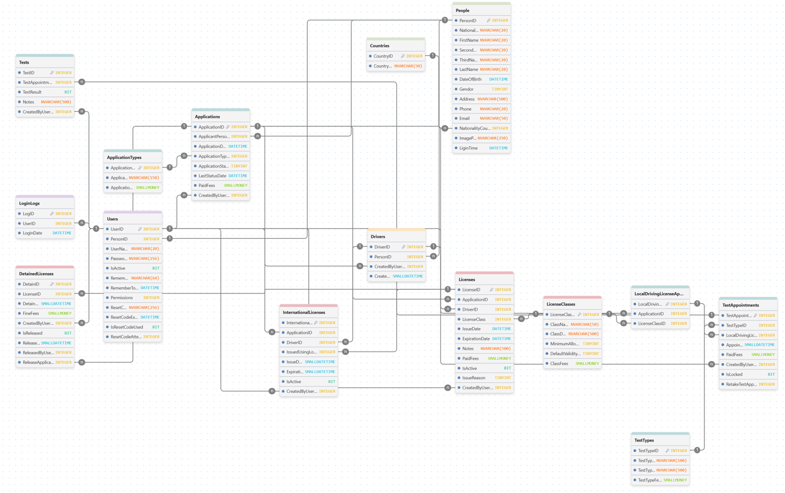

<!--
Replace the image above with the final ERD file generated from SQL Server.
Recommended path:
docs/database/DVLD_ERD.png
-->

---
# 🖼️ Screenshots

## 🔐 Login

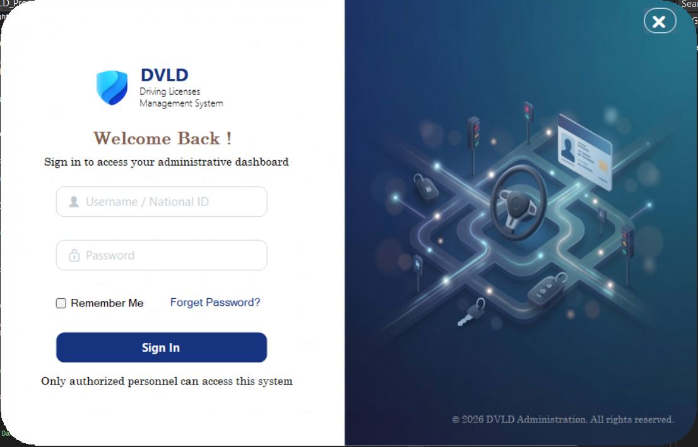

---

## 📊 Dashboard

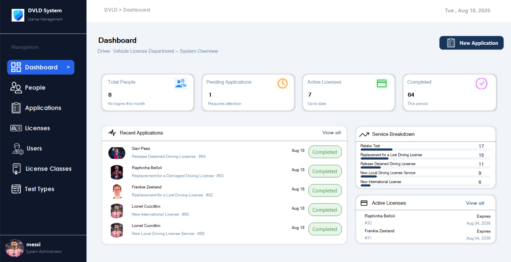

---

## 👥 People Management

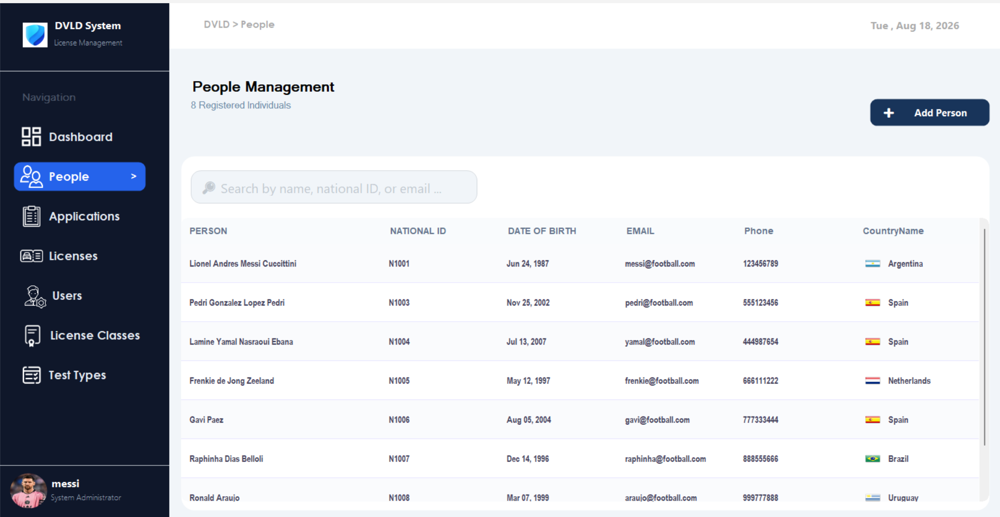

### 👤 Person Details

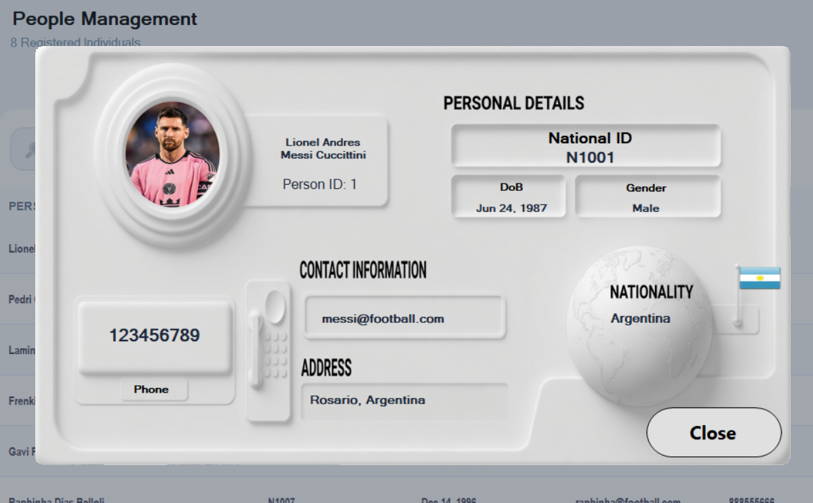

---

## 📄 Applications

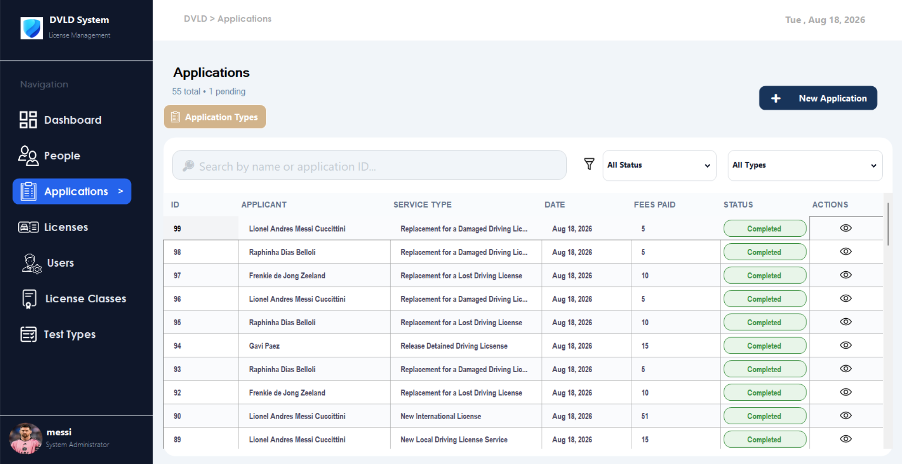

### 📋 Application Details

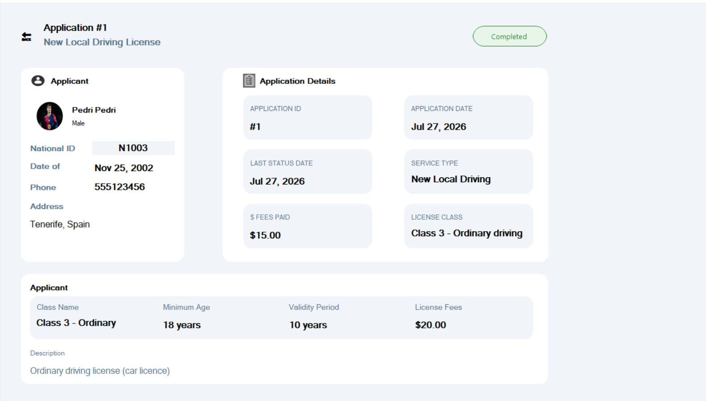

---

## 🧪 Tests & Appointments

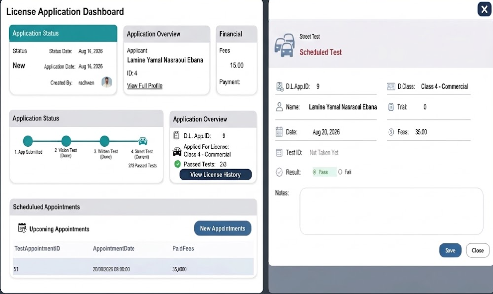

---

## 🧪 Test Types

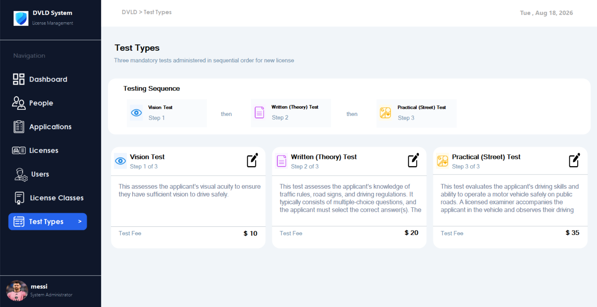

---

## 🪪 Licenses

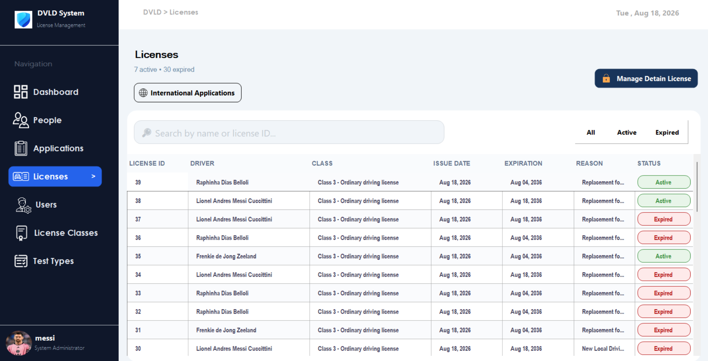

---

## 🌍 International Licenses

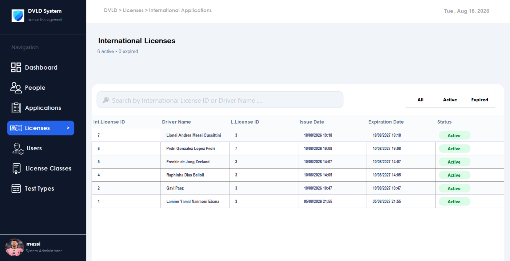

---

## 🚫 Detain License

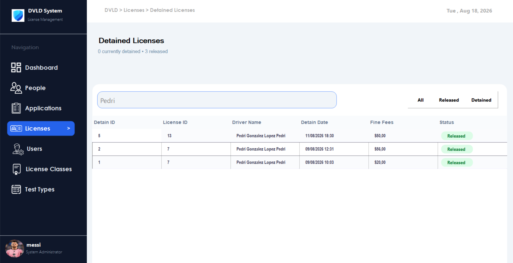

---

## 🏷️ License Classes

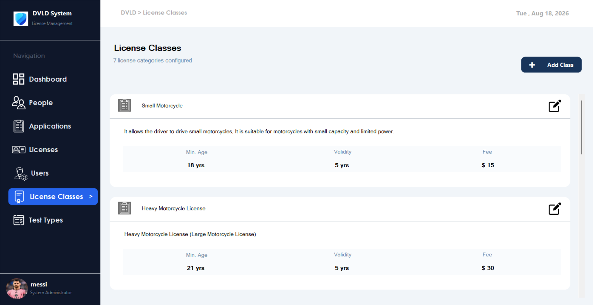

---

## 📝 Application Types

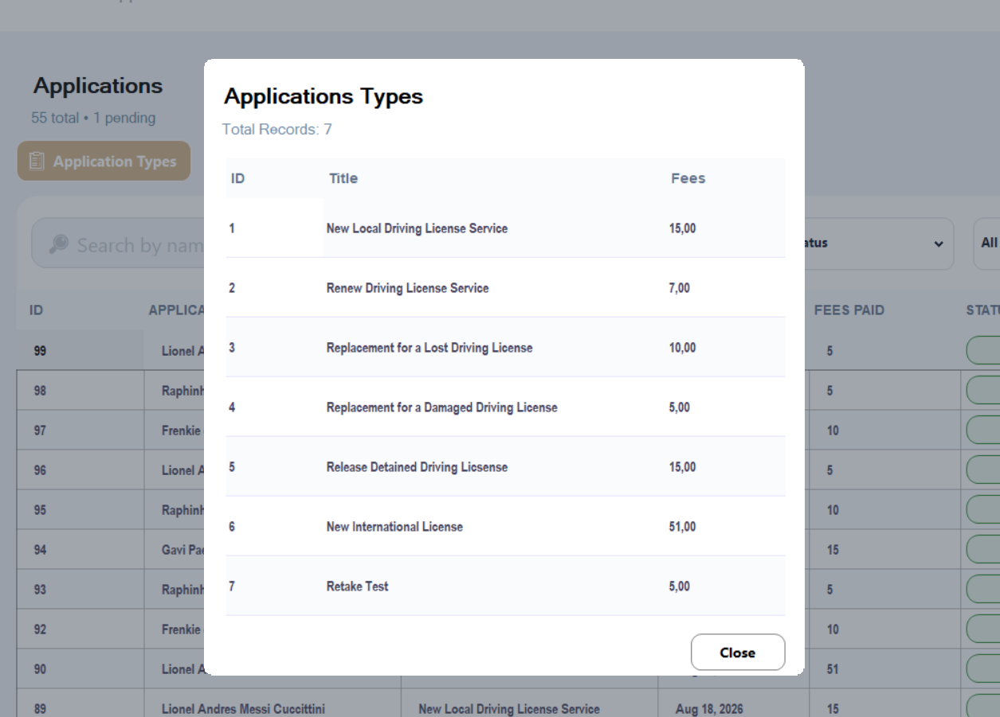

---

## 👤 Users

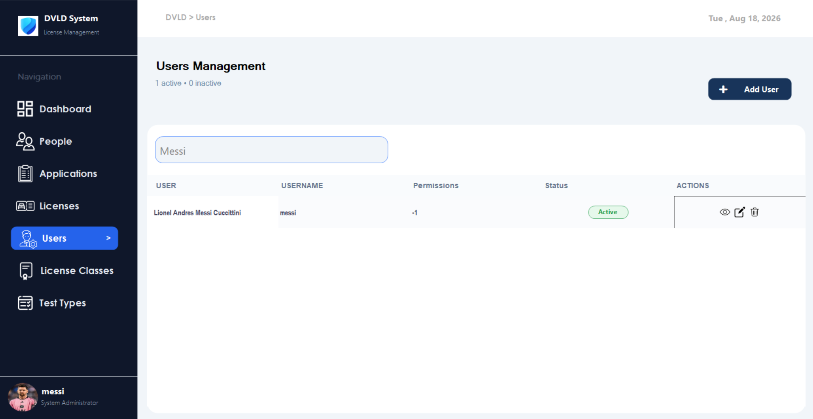

### 👤 User Details

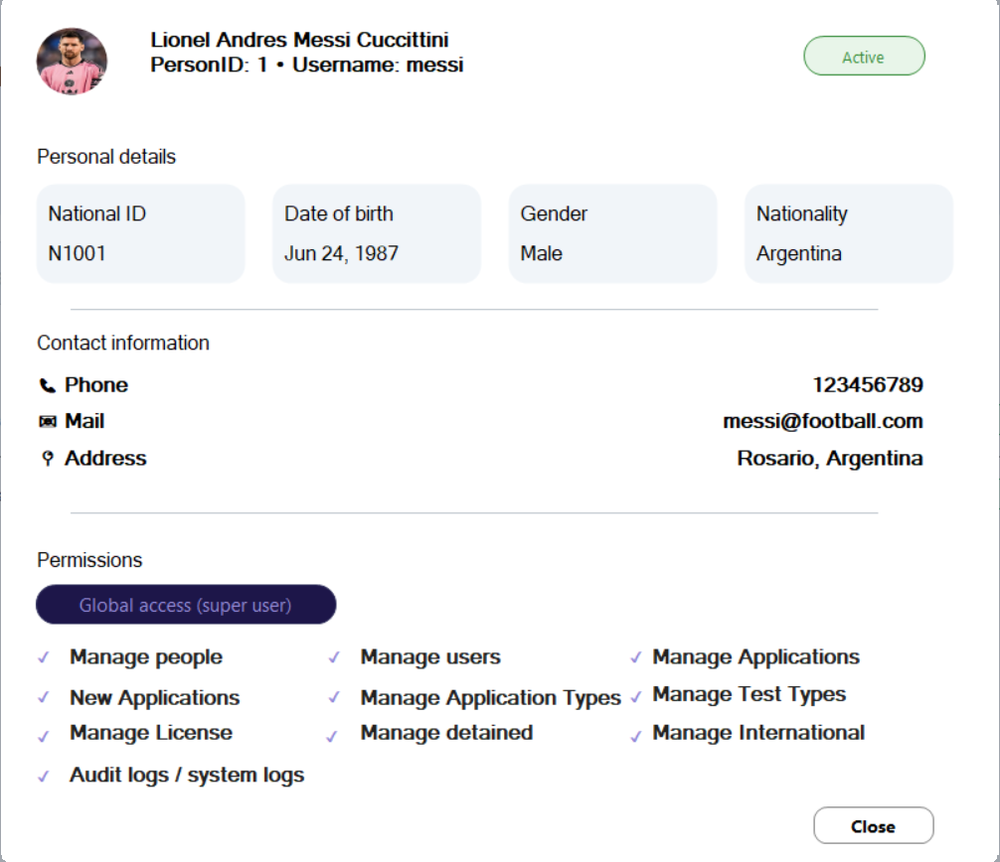

---

## 🔑 Forgot Password  ### 🔢 Verify Code  ### 🔄 Reset Password

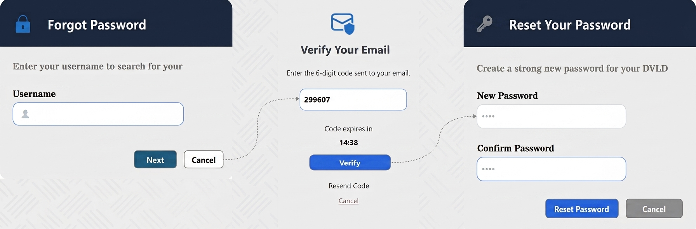

---


# 🛠️ Technology Stack

| Technology            | Usage                            |
| --------------------- | -------------------------------- |
| **C#**                | Main programming language        |
| **.NET 9**            | Application framework            |
| **Windows Forms**     | Desktop UI framework             |
| **Guna.UI2.WinForms** | Modern UI components and styling |
| **SQL Server**        | Database management              |
| **ADO.NET**           | Data access                      |
| **Stored Procedures** | Database operations              |
| **Visual Studio**     | Development environment          |

---

# 🔐 Security

The project contains a dedicated security module:

```text
DVLD_Security/
├── DPAPIHelper.cs
├── HashHelper.cs
├── RememberMeManager.cs
└── TokenHelper.cs
```

Security-related functionality includes:

* Hashing utilities.
* Token generation and management.
* Remember Me functionality.
* Token expiration.
* DPAPI protection for locally stored Remember Me data.
* Hashed token storage in the database.
* Password reset-code hashing.
* Password reset-code expiration.
* Verification-code resend cooldown.

### Security Roadmap

PBKDF2 with a unique salt per password is **not currently implemented**.

It is planned as a future improvement to strengthen password-storage security.

---

# 📧 Email Service

Email functionality is isolated in a dedicated project:

```text
DVLD_EmailService/
```

The application uses an abstraction through:

```csharp
IEmailService
```

and an implementation through:

```csharp
EmailService
```

The service is currently used by the password recovery workflow to send verification/reset codes.

---

# 🔄 Application Workflow

A simplified local driving-license workflow:

```text
                    ┌──────────────┐
                    │    Person    │
                    └──────┬───────┘
                           │
                           ▼
                  ┌─────────────────┐
                  │   Application   │
                  └────────┬────────┘
                           │
                           ▼
                  ┌─────────────────┐
                  │   Vision Test   │
                  └────────┬────────┘
                           │
                         Pass
                           │
                           ▼
                  ┌─────────────────┐
                  │  Written Test   │
                  └────────┬────────┘
                           │
                         Pass
                           │
                           ▼
                  ┌─────────────────┐
                  │   Street Test   │
                  └────────┬────────┘
                           │
                         Pass
                           │
                           ▼
                  ┌─────────────────┐
                  │     License     │
                  └─────────────────┘
```

If a test is failed:

```text
Test
 │
 ▼
Failed
 │
 ▼
Retake Application
 │
 ▼
Retake Appointment
 │
 ▼
Retake Test
```

---

# ⚙️ Installation & Setup

## Prerequisites

Before running the project, make sure the development environment contains:

* Windows
* Visual Studio
* .NET 9 SDK
* SQL Server
* SQL Server Management Studio (recommended)

---

## 1. Clone the Repository

```bash
git clone <repository-url>
```

> Replace `<repository-url>` with your repository URL.

---

## 2. Open the Solution

Open the DVLD solution in **Visual Studio**.

Make sure all projects are loaded:

```text
DVLD_BusinessLayer
DVLD_DataAccessLayer
DVLD_EmailService
DVLD_PresentationLayer
DVLD_Security
```

---

## 3. Configure SQL Server

Create or restore the `DVLD` database in SQL Server.

The database must contain the required:

* Tables
* Relationships
* Stored Procedures
* Views
* Functions
* Triggers

---

## 4. Configure the Connection String

Update the application's database connection string in:

```text
DVLD_PresentationLayer/App.config
```

Use the SQL Server instance and authentication configuration of your local environment.

> Do not commit passwords, API keys, email credentials, or other secrets to the repository.

---

## 5. Configure Email Service

The password recovery workflow requires a working email configuration.

Configure the email service according to the project's `DVLD_EmailService` implementation.

---

## 6. Build and Run

Build the solution in Visual Studio and run the presentation project.

The application should start from the login screen.

---

# 📁 Suggested Documentation Structure

For the screenshots and database diagram used in this README, the following structure is recommended:

```text
DVLD/
│
├── docs/
│   ├── images/
│   │   ├── Login.png
│   │   ├── Dashboard.png
│   │   ├── People.png
│   │   ├── PersonDetails.png
│   │   ├── Applications.png
|   |   ├── ApplicationDetails.png
|   |   ├── ApplicationTypes.png
|   |   ├── Users.png
|   |   ├── UserDetails.png
│   │   ├── tests.png
│   │   ├── TestTypes.png
│   │   ├── Licenses.png
│   │   ├── LicenseClasses.png
│   │   ├── DetainLicense.png
│   │   ├── InternationalLicenses.png
│   │   └── ForgotPassword.jpg
│   │
│   └── database/
│       └── DVLD_ERD.png
│
└── README.md
```

---

# 🚀 Future Improvements

Potential future improvements include:

* [ ] Upgrade password hashing to **PBKDF2 with a unique per-user salt**.
* [ ] Improve centralized application logging.
* [ ] Add automated unit and integration tests.
* [ ] Improve database deployment/setup automation.
* [ ] Further optimize dashboard loading and UI rendering.
* [ ] Improve validation and error-handling consistency.
* [ ] Add more comprehensive documentation for business rules.
* [ ] Add a dedicated database deployment script.
* [ ] Add application configuration management for different environments.

---

# 📚 Development Concepts Demonstrated

This project demonstrates practical experience with:

* Object-Oriented Programming.
* Layered Architecture.
* Separation of Concerns.
* Business Logic Layering.
* Data Access Abstraction.
* ADO.NET.
* SQL Server.
* Stored Procedures.
* Database Relationships.
* Windows Forms.
* Event-driven programming.
* Reusable UserControls.
* Authentication.
* Token-based Remember Me.
* DPAPI.
* Hashing.
* Email-based verification.
* Password recovery workflows.
* Application state management.
* Dashboard optimization.
* UI/UX organization.

---

# 🎯 Project Status

**Current Status:** Functional / Development Project

The project currently includes the main DVLD management workflows, authentication and account recovery, database integration, license management, test management, international license functionality, and dashboard functionality.

The repository is currently private.

---

# 👨‍💻 Author

**Radhwen Hmad**

Computer Engineering Student
Tunisia

---

# 📌 Notes

This project was developed as a practical software engineering project to apply concepts related to:

* C#
* .NET
* Desktop Application Development
* SQL Server
* ADO.NET
* Software Architecture
* Database Design
* Authentication & Security
* Business Logic
* UI/UX

---
